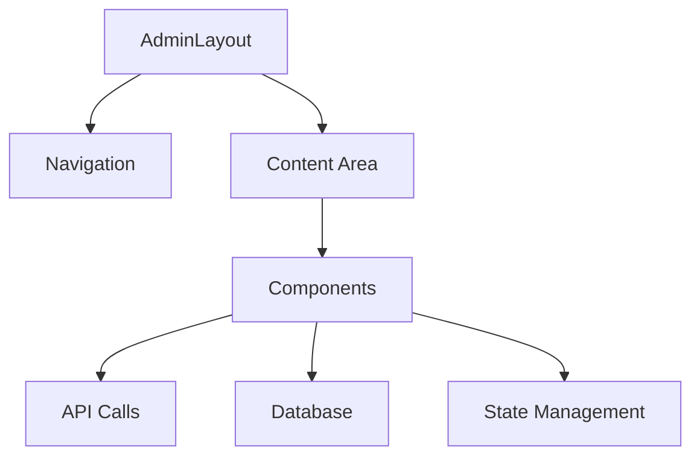

# Trade PX Admin Panel

Административная панель для управления криптовалютной биржей. Проект построен с использованием React, TypeScript, Chakra UI и других современных технологий.

## 🏗 Архитектура проекта

### Основные компоненты

```
admin/
├── src/
│   ├── components/        # UI компоненты
│   │   ├── admin/        # Компоненты админ-панели
│   │   │   ├── settings/ # Настройки системы
│   │   │   ├── users/    # Управление пользователями
│   │   │   ├── audit/    # Аудит действий
│   │   │   └── ...
│   ├── contexts/         # React контексты
│   ├── hooks/           # Пользовательские хуки
│   ├── stores/          # Zustand сторы
│   ├── utils/           # Утилиты
│   └── db/              # Работа с базой данных
```

### Основные страницы

1. **Дашборд** (`/admin`)
   - Общая статистика
   - Графики активности
   - Быстрые действия

2. **Пользователи** (`/admin/users`)
   - Список пользователей
   - Управление ролями
   - Блокировка/разблокировка

3. **Балансы** (`/admin/balances`)
   - Управление балансами пользователей
   - История транзакций
   - Аудит операций

4. **Верификация** (`/admin/verification`)
   - Запросы на верификацию
   - Проверка документов
   - Управление уровнями KYC

5. **Аудит** (`/admin/audit`)
   - Логи действий
   - Фильтрация и поиск
   - Экспорт данных

6. **Настройки** (`/admin/settings`)
   - Общие настройки
   - Безопасность
   - Уведомления

### Взаимодействие компонентов



## 🔒 Безопасность

### Уровни доступа

1. **Администратор**
   - Полный доступ ко всем функциям
   - Управление другими администраторами
   - Изменение системных настроек

2. **Модератор**
   - Управление пользователями
   - Проверка верификации
   - Просмотр логов

### Защита админ-панели

1. **Двухфакторная аутентификация**
2. **Белый список IP-адресов**
3. **Ограничение попыток входа**
4. **Аудит всех действий**

## 🚀 Развертывание

### Требования

- Node.js 18+
- PostgreSQL 14+
- Redis (опционально)
- Nginx

### Установка

1. Клонирование репозитория:
```bash
git clone <repository-url>
cd admin
```

2. Установка зависимостей:
```bash
npm install
```

3. Настройка переменных окружения:
```bash
cp .env.example .env
```

4. Сборка проекта:
```bash
npm run build
```

### Настройка Nginx

```nginx
server {
    listen 80;
    server_name admin.yourdomain.com;

    location / {
        proxy_pass http://localhost:5174;
        proxy_http_version 1.1;
        proxy_set_header Upgrade $http_upgrade;
        proxy_set_header Connection 'upgrade';
        proxy_set_header Host $host;
        proxy_cache_bypass $http_upgrade;
    }

    # Security headers
    add_header X-Frame-Options "DENY";
    add_header X-Content-Type-Options "nosniff";
    add_header X-XSS-Protection "1; mode=block";
    add_header Content-Security-Policy "default-src 'self'";
    add_header Strict-Transport-Security "max-age=31536000; includeSubDomains";
}
```

### SSL-сертификат

```bash
certbot --nginx -d admin.yourdomain.com
```

### Firewall

```bash
# Разрешаем только необходимые порты
ufw allow 80
ufw allow 443
ufw allow 5174

# Ограничиваем доступ по IP
ufw allow from YOUR_IP_ADDRESS to any port 5174
```

## 📝 Разработка

### Запуск в режиме разработки

```bash
npm run dev
```

### Тестирование

```bash
npm run test
```

### Линтинг

```bash
npm run lint
```

## 🔄 CI/CD

### GitHub Actions

```yaml
name: Deploy Admin Panel

on:
  push:
    branches: [ main ]

jobs:
  deploy:
    runs-on: ubuntu-latest
    steps:
      - uses: actions/checkout@v2
      - name: Setup Node.js
        uses: actions/setup-node@v2
        with:
          node-version: '18'
      - name: Install dependencies
        run: npm ci
      - name: Build
        run: npm run build
      - name: Deploy
        run: # deployment steps
```

## 📚 API Документация

API документация доступна по адресу `/admin/api-docs` после запуска проекта.

## 🔍 Мониторинг

- Логирование через Winston
- Метрики Prometheus
- Алерты через Telegram/Email

## 🤝 Вклад в проект

1. Форкните репозиторий
2. Создайте ветку для фичи (`git checkout -b feature/amazing-feature`)
3. Закоммитьте изменения (`git commit -m 'Add amazing feature'`)
4. Отправьте изменения в репозиторий (`git push origin feature/amazing-feature`)
5. Откройте Pull Request

## 📄 Лицензия

MIT License

## 👥 Команда

- Frontend Developer - [Name]
- Backend Developer - [Name]
- DevOps Engineer - [Name]

## 📞 Поддержка

Email: support@yourdomain.com